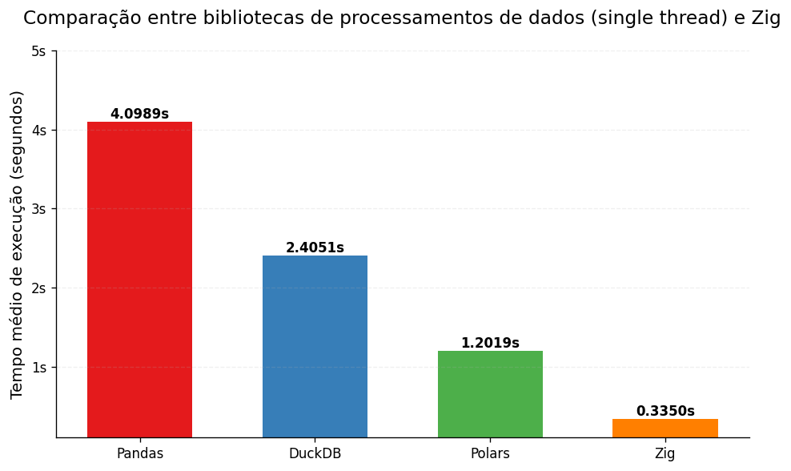
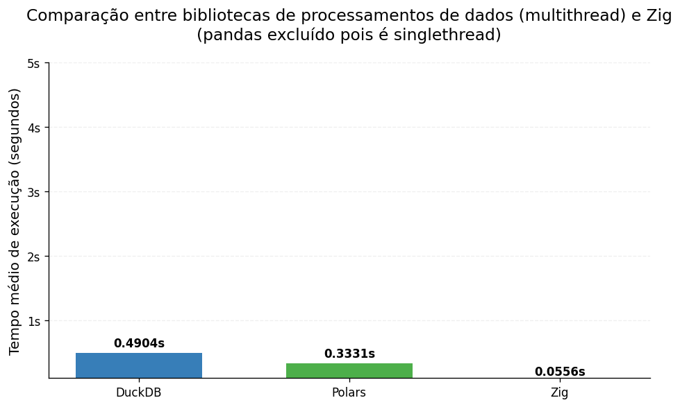

# Comparação entre bibiotecas de dados e uma solução em Zig


## Resultados






## Sobre os dados

[aqui](https://www.b3.com.br/pt_br/market-data-e-indices/servicos-de-dados/market-data/cotacoes/cotacoes/)


## Para buildar os binários em Zig

Para buildar a versão singlethreaded:
```
cd zig-single
zig build -Doptimize=ReleaseFast
```
Para buildar a versão multithreaded:
```
cd zig-multi
zig build -Doptimize=ReleaseFast
```

## Para rodar os benchmarks

O código em Python a seguir execute 10 vezes os códigos e retorna a média de tempo.

```bash
python3 run_tests.py
```