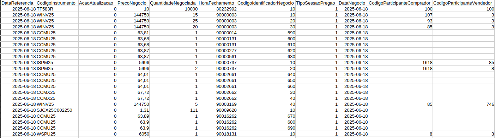

# Comparação entre bibiotecas de dados e uma solução em Zig

O presente projeto busca comparar soluções usuais de análise de dados com uma solução em uma linguagem de baixo nível, sendo Zig a escolhida. A ideia é mostrar que tais linguagens também podem ser utilizadas para tais tarefas, embora não seja tão usual. 


Para tanto, foi escolhida uma base de dados com um tamanho relativamente grande (10 milhões de observação e aproximadamente 700mb) que contém todas as transações na B3 no dia 18/06/2025. Busca-se extrair o preço máximo, mínimo e médio (ponderado pela quantidade de transações) do ativo WDON25 no dia especificado anteriormente.

## Resultados

As soluções foram implementadas inicialmente forçando o uso de apenas uma thread. O gráfico abaixo ilustra o tempo de execução médio das soluções. É importante notar que o tempo da solução em Zig (tanto single threaded como multithreaded) não inclui o tempo de compilação do projeto.


Habilitando o processamento paralelo nota-se uma visível melhora no tempo médio de execução das soluções. Em especial a solução em Zig com 16 threads é aproximandamente 73 vezes mais rápida que a solução inicial em Pandas sem processamento paralelo.


## Sobre os dados

Os dados consistem em todas as trasações em um certo dia na B3, a bolsa de valores brasileira. Eles podem ser encontrados
[aqui](https://www.b3.com.br/pt_br/market-data-e-indices/servicos-de-dados/market-data/cotacoes/cotacoes/) e são disponibilizados no dia útil seguinte ao dia da transação, ficam disponíveis por 20 dias úteis.


Para este projeto fora utilizado o dia 18/06/2025 escolhido arbitrariamente. No total, há mais de 10 milhões de observações no arquivo, sendo aproximadamente 760 mil do ativo em questão. A figura abaixo ilustra o conjunto de dados.




## Para buildar os binários em Zig

Para buildar a versão singlethreaded:
```
cd zig-single
zig build -Doptimize=ReleaseFast
```
Para buildar a versão multithreaded:
```
cd zig-multi
zig build -Doptimize=ReleaseFast
```

## Para rodar os benchmarks

O código em Python a seguir execute 10 vezes os códigos e retorna a média de tempo.

```bash
python3 run_tests.py
```

A versão do Python utilizada é a 3.12.11 e a versão do Zig é a 0.14.1.